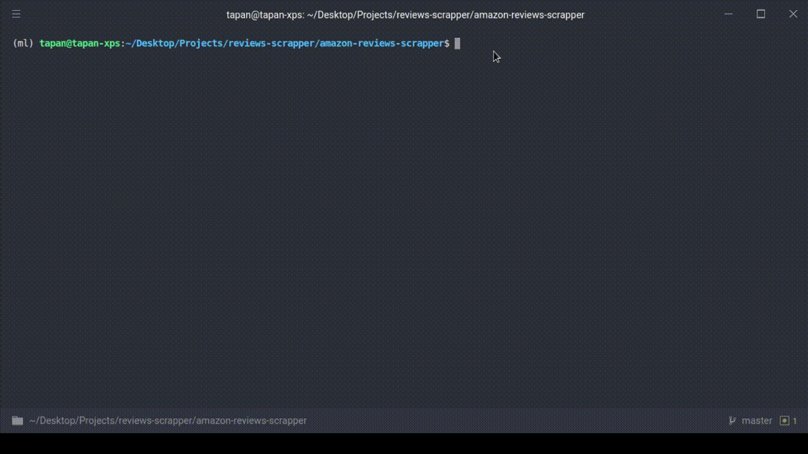

# Amazon-Reviews-Scrapper

Amazon-Reviews-Scrapper is a simple reviews scrapper that scrapes all types ( all stars ratings ) reviews of a particular product and save in the .csv file

## Installation

Use git clone to clone app

```bash
git clone https://github.com/tapan2930/amazon-reviews-scrapper.git
```

```cd``` into the folder just cloned and pip install requirements.txt

```bash
pip install -r requirements.txt 
```

## Usage

```bash
python main.py
```



## Contributing
Pull requests are welcome. For major changes, please open an issue first to discuss what you would like to change.


## License
[MIT](./LICENSE)